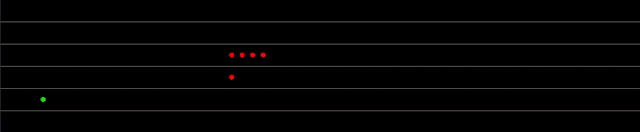

# PySnake

 

A tiny implementation on the snake game created using the [opc.py](https://github.com/scanlime/fadecandy/blob/master/examples/python/opc.py) library to display on a fadecandy LED display. This project was created by @firasahmed & me as a first year university project. The code is extensively documented (using comments) & follows PEP 8 naming conventions for highly readable & understandable code.

